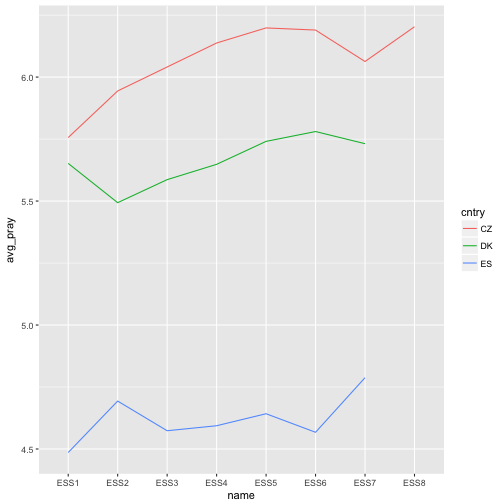

<style>
bold {font-weight: bold; }

.small-code pre code {
  font-size: 0.2em;
}

.section .reveal .state-background {
    background: white;
}

.section .reveal p {
   color: black;
   text-align:center;
   font-size: 1.8em;
}

.section .reveal h1,
.section .reveal h2 {
    color: black;
    text-align:center;
    width:100%;
}
</style>


The ess package
========================================================
author: Jorge Cimentada
date: 19/1/2018
class: small-code
autosize: true

<div align="center">

</div>

ess package
========================================================

The philosophy of the `ess` package is very simple

<div align="center">
"Concentrate on your analysis rather than on searching for information"
</div>

<br>

It fits with the general idea of obtaining data within R from packages such as: 
- [OECD](https://cran.r-project.org/web/packages/OECD/OECD.pdf)
- [World Bank](https://cran.r-project.org/web/packages/wbstats/vignettes/Using_the_wbstats_package.html)
- [Eurostat](https://cran.r-project.org/web/packages/eurostat/vignettes/eurostat_tutorial.pdf)

For a very cool compendium of 'data packages' see the series of post by my good friend [Ilya Kashnitsky](https://ikashnitsky.github.io/2017/data-acquisition-one/)

ess package
========================================================

It aims to fix four broad problems:

- It's often difficult to keep track of all country/rounds/themes available in the ESS

- It's even trickier to find which countries participated in which rounds

- It's cumbersome to download/redownload data to search for variables

- Avoid leaving your 'analysis phase' to search for information

ess package
========================================================

Requirements:

- Internet connection

- Registered user at http://www.europeansocialsurvey.org/user/new

ess package
========================================================

There two family of functions

- `ess_` family: to download data

- `show_` family: to retrieve information from the ess website

In action
========================================================


```r
install.packages("ess")
library(ess)
```


```r
show_rounds()
```

```
[1] 1 2 3 4 5 6 7 8
```


```r
all_rnds <- ess_rounds(1:8, "your_registered@email.com")
```

In action
========================================================


```r
all_vars <- lapply(all_rnds, names)

common_vars <- Reduce(function(x, y) intersect(x, y), all_vars)

common_vars
```

```
  [1] "name"     "essround" "edition"  "proddate" "cntry"    "idno"    
  [7] "ppltrst"  "pplfair"  "pplhlp"   "polintr"  "trstprl"  "trstlgl" 
 [13] "trstplc"  "trstplt"  "trstep"   "trstun"   "vote"     "contplt" 
 [19] "wrkprty"  "wrkorg"   "badge"    "sgnptit"  "pbldmn"   "bctprd"  
 [25] "clsprty"  "prtdgcl"  "lrscale"  "stflife"  "stfeco"   "stfgov"  
 [31] "stfdem"   "stfedu"   "stfhlth"  "gincdif"  "freehms"  "happy"   
 [37] "sclmeet"  "sclact"   "crmvct"   "aesfdrk"  "health"   "hlthhmp" 
 [43] "rlgblg"   "rlgdnm"   "rlgblge"  "rlgdnme"  "rlgdgr"   "rlgatnd" 
 [49] "pray"     "dscrgrp"  "dscrrce"  "dscrntn"  "dscrrlg"  "dscrlng" 
 [55] "dscretn"  "dscrage"  "dscrgnd"  "dscrsex"  "dscrdsb"  "dscroth" 
 [61] "dscrdk"   "dscrref"  "dscrnap"  "dscrna"   "ctzcntr"  "brncntr" 
 [67] "blgetmg"  "facntr"   "mocntr"   "imsmetn"  "imdfetn"  "impcntr" 
 [73] "imbgeco"  "imueclt"  "imwbcnt"  "hhmmb"    "gndr"     "gndr2"   
 [79] "gndr3"    "gndr4"    "gndr5"    "gndr6"    "gndr7"    "gndr8"   
 [85] "gndr9"    "gndr10"   "gndr11"   "gndr12"   "yrbrn"    "agea"    
 [91] "yrbrn2"   "yrbrn3"   "yrbrn4"   "yrbrn5"   "yrbrn6"   "yrbrn7"  
 [97] "yrbrn8"   "yrbrn9"   "yrbrn10"  "yrbrn11"  "yrbrn12"  "domicil" 
[103] "eisced"   "eduyrs"   "pdwrk"    "edctn"    "uempla"   "uempli"  
[109] "dsbld"    "rtrd"     "cmsrv"    "hswrk"    "dngoth"   "dngdk"   
[115] "dngref"   "dngna"    "mainact"  "mnactic"  "crpdwk"   "pdjobev" 
[121] "pdjobyr"  "emplrel"  "emplno"   "estsz"    "jbspv"    "njbspv"  
[127] "wkhct"    "wkhtot"   "uemp3m"   "uemp12m"  "uemp5yr"  "mbtru"   
[133] "hincfel"  "pdwrkp"   "edctnp"   "uemplap"  "uemplip"  "dsbldp"  
[139] "rtrdp"    "cmsrvp"   "hswrkp"   "dngothp"  "dngdkp"   "dngnapp" 
[145] "dngrefp"  "dngnap"   "mnactp"   "crpdwkp"  "emprelp"  "wkhtotp" 
[151] "emprf14"  "emprm14"  "atncrse"  "chldhm"   "chldhhe"  "ipcrtiv" 
[157] "imprich"  "ipeqopt"  "ipshabt"  "impsafe"  "impdiff"  "ipfrule" 
[163] "ipudrst"  "ipmodst"  "ipgdtim"  "impfree"  "iphlppl"  "ipsuces" 
[169] "ipstrgv"  "ipadvnt"  "ipbhprp"  "iprspot"  "iplylfr"  "impenv"  
[175] "imptrad"  "impfun"   "intewde"  "inwshh"   "inwsmm"   "inwehh"  
[181] "inwemm"   "inwtm"    "dweight"  "pweight" 
```

In action
========================================================


```r
attr(all_rnds[[3]]$pray, "label")
```

```
[1] "How often pray apart from at religious services"
```

```r
attr(all_rnds[[3]]$pray, "labels")
```

```
                Every day     More than once a week 
                        1                         2 
              Once a week     At least once a month 
                        3                         4 
Only on special holy days                Less often 
                        5                         6 
                    Never                   Refusal 
                        7                        77 
               Don't know                 No answer 
                       88                        99 
```

```r
filtered_df <- lapply(all_rnds, function(x) x[c("name", "cntry", "pray")])
```

In action
========================================================


```r
library(tidyverse)

filtered_df %>%
  reduce(rbind) %>%
  filter(cntry %in% c("DK", "CZ", "ES"),
         pray <= 7) %>%
  mutate(name = str_extract(name, "^ESS[0-9]{1,}")) %>%
  group_by(name, cntry) %>%
  summarize(avg_pray = mean(pray, na.rm = TRUE)) %>%
  ggplot(aes(name, avg_pray, group = cntry, colour = cntry)) +
  geom_line()
```



In action
========================================================


```r
library(eurostat)

all_fertility <- eurostat::get_eurostat("demo_r_find2")

reg_indicator <-
  all_fertility %>%
  filter(str_detect(geo, "^ES"),
         time >= "2006-01-01",
         time <  "2007-01-01",
         indic_de == "AGEMOTH") %>%
  separate(geo, c("cntry", "region"), sep = 2) %>%
  transmute(cntry,
            region = ifelse(region == "", NA, region),
            avg_ageb = values) %>%
  filter(!is.na(region))
```


In action
========================================================


```r
region_es <-
  all_rnds[[3]] %>%
  transmute(cntry,
            region = as.character(regioaes),
            pray) %>%
  filter(cntry == "ES") %>%
  left_join(reg_indicator, c("cntry", "region"))

region_es %>%
  group_by(region) %>%
  summarize(avg = mean(avg_ageb))
```

```
# A tibble: 18 x 2
   region   avg
    <chr> <dbl>
 1     11  31.4
 2     12  31.4
 3     13  31.2
 4     21  32.4
 5     22  31.5
 6     23  31.1
 7     24  31.4
 8     30  31.4
 9     41  31.6
10     42  30.7
11     43  30.9
12     51  30.9
13     52  30.8
14     53  30.5
15     61  30.4
16     62  30.2
17     63  29.5
18     70  30.0
```
